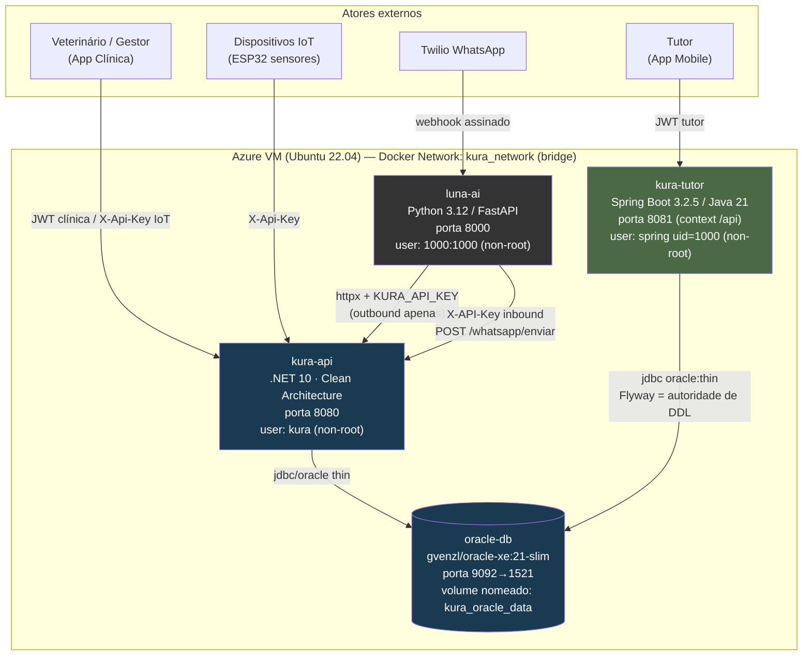
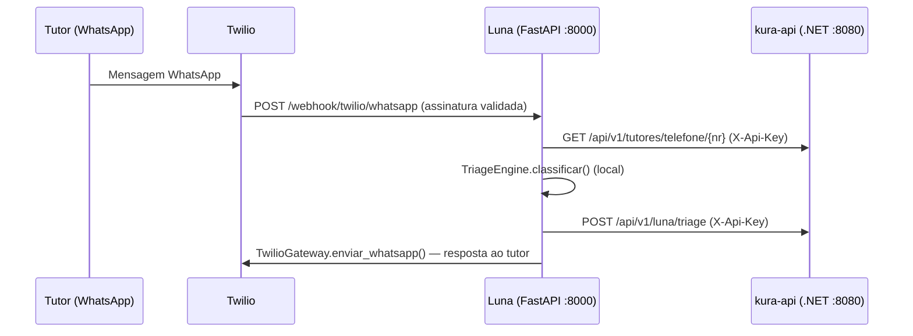

# Arquitetura KURA — Diagrama de Referência

> Fonte committável e versionável (Mermaid, renderiza nativamente no GitHub). Equivalente ao
> `docs/arquitetura-kura.drawio` (editável no [draw.io](https://app.diagrams.net/)) e ao PDF em
> `docs/Kura_Docs_DevOps.pdf`. Refletido a partir do `docker-compose.yml` real deste repositório —
> atualizar aqui sempre que portas, serviços ou volumes mudarem no compose.

## Diagrama de contêineres

## Legenda — serviços, portas e ownership

| Serviço | Imagem/contexto | Porta (host→container) | Owner de dados |
|---|---|---|---|
| `oracle-db` | `gvenzl/oracle-xe:21-slim` | `9092:1521` | Schema único compartilhado — volume nomeado `kura_oracle_data` (RUBRICA 2.3), persiste entre restarts |
| `kura-api` | build local (.NET 10) | `8080:8080` | `CLINICA`, `VETERINARIO`, `PET`, `EVENTO_CLINICO`, `NOTIFICACAO`, IoT, `TRIAGEM_LUNA`; `AGENDAMENTO` compartilhada (lock otimista) |
| `kura-tutor` | build local (Spring Boot 3.2.5 / Java 21) | `8081:8081` | `CONTA_TUTOR`, `CONSENTIMENTO`, `IDEMPOTENCY_KEY`; autoridade única de DDL (Flyway) |
| `luna-ai` | build local (FastAPI / Python 3.12) | `8000:8000` | Não persiste no Oracle — integra via `httpx` ao `kura-api` (outbound) e recebe webhooks Twilio/inbound `/whatsapp/enviar` |

## Rede e volume

- Rede: `kura_network` (bridge) — serviços resolvem uns aos outros pelo nome do container (`oracle-db`, `kura-api`, `kura-tutor`, `luna-ai`).
- Volume nomeado: `kura_oracle_data` montado em `/opt/oracle/oradata` — **não** é removido por `docker compose down`; requer `down -v` explícito para apagar.
- Todos os três serviços de aplicação rodam como usuário não-root no container (RUBRICA 2.2).

## Fluxo de dados — Luna → .NET (triagem via WhatsApp)

